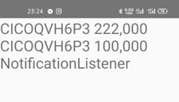

# Giới thiệu
Hệ thống gửi xe tự động sử dụng vi điều khiển STM32 và RFID, được thiết kế để giám sát hoạt động ra/vào và trừ phí ra/vào của xe trong bãi đỗ xe.
- Người dùng có thể đăng kí tài khoản để sử dụng hệ thống trên website.
- Sau khi đăng kí, người dùng được cấp duy nhất một thẻ từ dùng để xác thực khi vào/ra.
- Lượt vào không mất phí, lượt ra sẽ mất phí (3000 đồng).
- Người dùng có thể nạp tiền, xem số dư, lịch sử vào/ra bằng website của hệ thống.
# Demo
[Video demo](https://youtu.be/E9b4xb-xqo0).
# Thiết kế hệ thống

- Sử dụng vi điều khiển STM32f103c8t6 làm vi điều khiển chính kết hợp với ESP32 để kết nối internet.
- Mobile app là một thành phần của hệ thống, giúp đọc thông báo ngân hàng trên điện thoại của admin làm chức năng nạp nạp tiền.
## STM32
- Giao tiếp giữa STM32 và ESP32:
    - Sử dụng UART kết hợp với DMA và ngắt IDLE. Ngắt IDLE hay còn được gọi là ngắt phát hiện dòng nhàn rỗi, xảy ra khi một khung IDLE được phát hiện. Ưu điểm của nó dùng để nhận được dữ liệu có kích thước bất kỳ không biết trước.
    - Sử dụng định dạng http query parameter. Ví dụ: "cmd=read&id=123456".

- Giao tiếp với Lcd 16x2: Sử dụng giao thức I2C để giao tiếp với Lcd 16x2.
- Giao tiếp với RFID module: Sử dụng giao thức SPI để giao tiếp với RFID module.
## ESP32
- Sử dụng framework arduino.
- Có chức năng chính là chuyển tiếp các request từ stm32 lên server bằng giao thức http get (sử dụng thư viện HTTPClient).
- Có giao diện để kết nối wifi (sử dụng thư viện WiFiManager).

## Server
- Expressjs là một framework được xây dựng trên nền tảng của Nodejs. Nó cung cấp các tính năng mạnh mẽ để phát triển web hoặc mobile. Expressjs hỗ trợ các method HTTP và midleware tạo ra API vô cùng mạnh mẽ và dễ sử dụng.
- Pug là một template engine hiệu suất cao, mạnh mẽ, dễ hiểu và giàu các tính năng. Pug giúp giảm thời gian phát triển bằng cách cung cấp các tính năng không có sẵn trong HTML thuần tuý giúp hoàn thành nhanh hơn các công việc lặp đi lặp lại.
### Chức năng đăng kí

### Giao diện chính

## App đọc thông báo biến động số dư
- Sử dụng NotificationListenerService được hỗ trợ sẵn trên android để đọc thông báo từ ngân hàng.
- Khi đọc được thông báo, dựa vào 4 kí tự đầu của mã giao dịch (CICO) để lọc ra mã giao dịch.
- Gửi mã giao dịch và số tiền lên server bằng http get.
- Có giao diện hiển thị mã giao dịch đã đọc được và số tiền của giao dịch đó.
